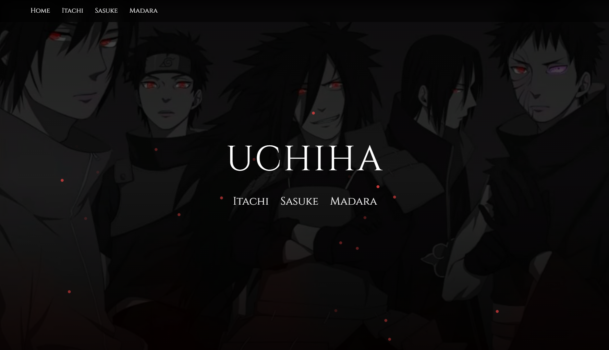
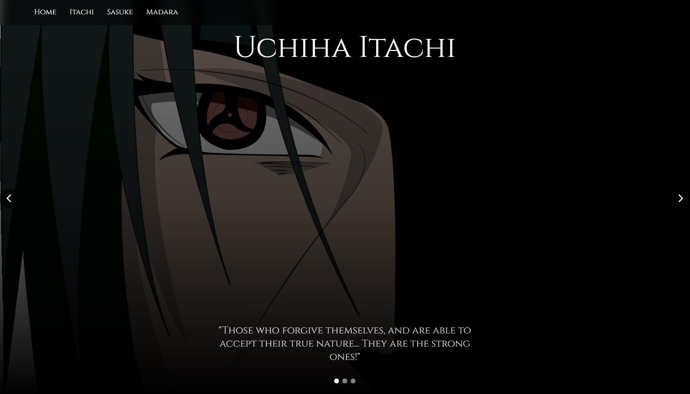
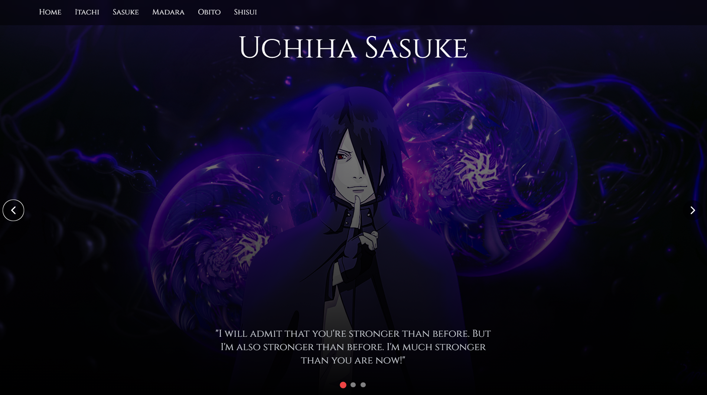
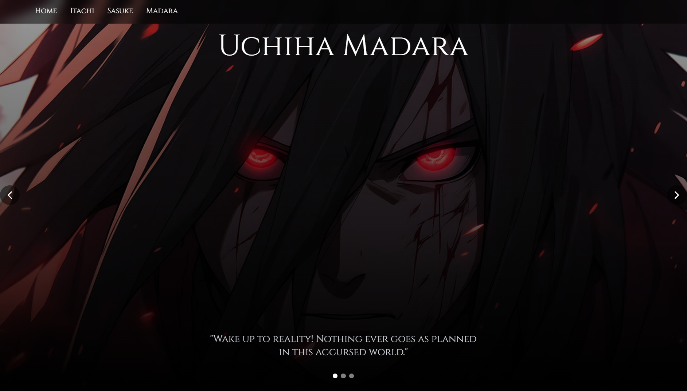

# Uchiha Website

Welcome to the Uchiha Interactive Experience! This website allows you to explore the world of Uchiha Itachi, Sasuke, and Madara through an interactive and visually appealing interface.

## Home Page


## Itachi Page


## Sasuke Page 


## Madara Page


## Features
- **Character Showcase**: Explore different characters from the Uchiha clan.
- **Character Quotes**: "Experience famous quotes from each character."
- **Responsive Design**: Optimized for both desktop and mobile devices.


## View Live Preview
[**here**](https://uchiha-website.netlify.app/)

=======
## View Live Preview [**here**](https://uchiha-website.netlify.app/)
---

## Getting Started

### Prerequisites
- Node.js  
- npm  

### Installation
1. Clone the repository:  
   ```sh
   git clone https://github.com/yourusername/uchiha-website.git
   ```

2. Navigate to the project directory:  
   ```sh
   cd uchiha-website
   ```

3. Install the dependencies:  
   ```sh
   npm install
   ```

### Running the Project
Start the development server:  
```sh
npm run dev
```

Open your browser and navigate to [http://localhost:3000](http://localhost:3000).

---

## Project Structure
- **app**: Contains the main application components and pages.  
- **components**: Reusable UI components.  
- **public**: Static assets like images and fonts.  
- **styles**: Global CSS styles.  
- **tailwind.config.ts**: Tailwind CSS configuration.  
- **tsconfig.json**: TypeScript configuration.  

---

## Contributing
Contributions are welcome! Please open an issue or submit a pull request.

---

## License
This project is licensed under the MIT License.

